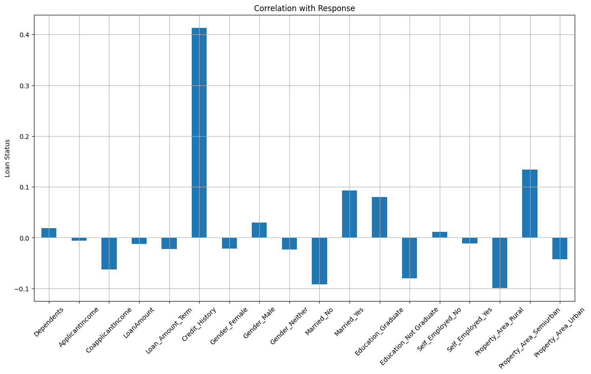
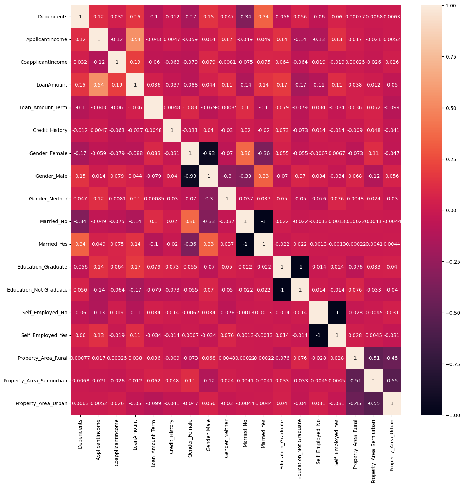
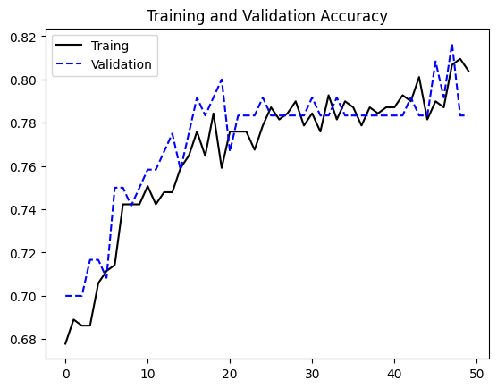
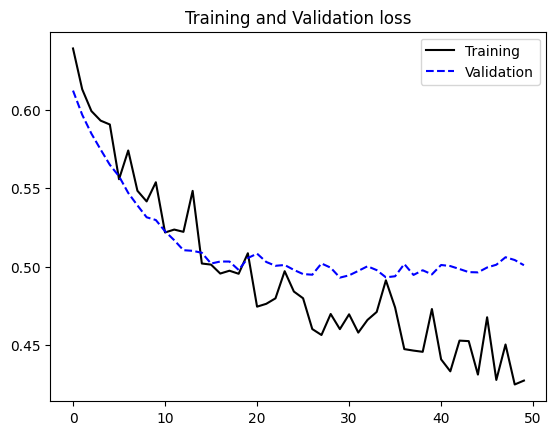

# Loan Approval Prediction

## Dataset 
- obtained from [Kaggle](https://www.kaggle.com/datasets/altruistdelhite04/loan-prediction-problem-dataset)

## Exploratory Data Analysis
### Explore Dataset
- Columns: 

| Feature           | Values(dtypes)                |
| ----------------- | ----------------------------- |
| Loan_ID           | object                        |
| Gender            | ['Male' 'Female' nan]         |
| Married           | ['No' 'Yes' nan]              |
| Dependents        | ['0' '1' '2' '3+' nan]        |
| Education         | ['Graduate' 'Not Graduate']   |
| Self_Employed     | ['No' 'Yes' nan]              |
| ApplicantIncome   | float64                       |
| CoapplicantIncom  | float64                       |
| LoanAmount        | float64                       |
| Loan_Amount_Term  | float64                       |
| Credit_History    | [ 1.  0. nan]                 |
| Property_Area     | ['Urban' 'Rural' 'Semiurban'] |
| Loan_Status       | ['Y' 'N']                     |
- The dataset was is imnbalanced with 422 Approvals and 192 Rejections
### Converting features to appropriate data types
- Remove Load_ID
- Gender: Change NaN to Neither and one-hot encode
- Married: Drop NaN values
- Dependents: Change 3+ to 3 and replace NaN with 0
- Education: One-hot encode
- Self_Employed: Replace NaN with 'No'
- Credit_Histpry: Replace NaN with 0
- Propert_Area: One-hot encode
- Loan_Status: convert to binary, `Yes = 1, No = 0`
- convert the resulting `bool` features to `int`

### Visualise
- Check for multicollinearity
- 
- 

- The major correlations are, as expected, between the one-hot encoded features like Gender, Marital Status etc. This is a natural consequence of one-hot encoding.

### Balance the dataset
Before Oversampling: `1: 411`, `0: 411`
After Oversampling: `1: 411`, `0:411`

## Building the Model
- Train/val/test split 60:20:20
- Scale the dataset:
    - Standard Scaler will be used
    - In order to not scale the binary features a Custom Scaler is used
    
    ```python
    class CustomScaler(BaseEstimator, TransformerMixin):
    def __init__(self, columns) -> None:
        self.scaler = MinMaxScaler()
        self.columns = columns 

    def fit(self, X, y=None):
        self.scaler.fit(X[self.columns])
        return self
    
    def transform(self, X):
        init_col_order = X.columns
        X_scaled = pd.DataFrame(self.scaler.transform(X[self.columns]), columns=self.columns, index=X.index)
        X_not_scaled = X.drop(self.columns, axis=1)
        return pd.concat([X_not_scaled, X_scaled], axis=1)[init_col_order]
    ```

    - This is needed if the goal is to pass a scaler throught a scikit-learn pipeline and passing that through a grid search.

    - SVM, Logistic Regression Classifier, Random Forests Classifier, and Gradient Boosted Classifier were fit to the data

    - Note: Crossvalidation with 5 folds is used in the GridSearch

    - A Neural Network was also used and compared to the other models

## Evaluating the Models

- __Training results__:

|                                         |   precision |   recall |   f1-score |
|:----------------------------------------|------------:|---------:|-----------:|
| ('SVC', 'Not Approved')                 |        1    |     1    |       1    |
| ('SVC', 'Approved')                     |        1    |     1    |       1    |
| ('Logistic Regression', 'Not Approved') |        0.77 |     0.62 |       0.69 |
| ('Logistic Regression', 'Approved')     |        0.68 |     0.82 |       0.74 |
| ('GradientBoosting', 'Not Approved')    |        0.92 |     0.89 |       0.91 |
| ('GradientBoosting', 'Approved')        |        0.9  |     0.92 |       0.91 |
| ('RandomForest', 'Not Approved')        |        0.79 |     0.78 |       0.78 |
| ('RandomForest', 'Approved')            |        0.78 |     0.79 |       0.79 |
| ('Neural Network', 'Not Approved')      |        0.44 |     0.74 |       0.55 |
| ('Neural Network', 'Approved')          |        0.92 |     0.75 |       0.83 |

- __Validation results__:

|                                         |   precision |   recall |   f1-score |   Avg CV accuracy |
|:----------------------------------------|------------:|---------:|-----------:|------------------:|
| ('SVC', 'Not Approved')                 |        1    |     1    |       1    |              0.84 |
| ('SVC', 'Approved')                     |        1    |     1    |       1    |              0.84 |
| ('Logistic Regression', 'Not Approved') |        0.77 |     0.62 |       0.69 |              0.68 |
| ('Logistic Regression', 'Approved')     |        0.68 |     0.82 |       0.74 |              0.68 |
| ('GradientBoosting', 'Not Approved')    |        0.66 |     0.66 |       0.66 |              0.74 |
| ('GradientBoosting', 'Approved')        |        0.66 |     0.66 |       0.66 |              0.74 |
| ('RandomForest', 'Not Approved')        |        0.63 |     0.59 |       0.61 |              0.71 |
| ('RandomForest', 'Approved')            |        0.62 |     0.66 |       0.64 |              0.71 |
| ('NeuralNetwork', 'NotApproved')        |        0.44 |     0.73 |       0.55 |            nan    |
| ('NeuralNetwork', 'Approved')           |        0.93 |     0.8  |       0.86 |            nan    |

- __Testing results__:

|                                         |   precision |   recall |   f1-score |
|:----------------------------------------|------------:|---------:|-----------:|
| ('SVC', 'Not Approved')                 |        0.99 |     0.86 |       0.92 |
| ('SVC', 'Approved')                     |        0.87 |     0.99 |       0.93 |
| ('Logistic Regression', 'Not Approved') |        0.78 |     0.57 |       0.66 |
| ('Logistic Regression', 'Approved')     |        0.66 |     0.84 |       0.74 |
| ('GradientBoosting', 'Not Approved')    |        0.77 |     0.67 |       0.72 |
| ('GradientBoosting', 'Approved')        |        0.71 |     0.79 |       0.75 |
| ('RandomForest', 'Not Approved')        |        0.69 |     0.63 |       0.66 |
| ('RandomForest', 'Approved')            |        0.66 |     0.72 |       0.69 |
| ('NeuralNetwork', 'NotApproved')        |        1    |     0.5  |       0.66 |
| ('NeuralNetwork', 'Approved')           |        0    |     0    |       0    |


- Each of the models overfits as evidenced by their accuracies. For the Neural Network, validation loss stops decreasing after 20 epochs:

    
    

## Conclusion 
An SVM seems to the best model, yielding the best results and being less likely to overfit than the ensemble models and the neural network.
